# HttpClient

## 提供从 IDEA Editor 编写和执行 HTTP 请求的能力

### 主要功能如下：

- 支持发起 GET、POST 等请求
- 支持发起 WebSocket 请求
- 支持发起 Dubbo 请求
- 支持环境变量、内置变量和内置方法
- 支持从 url 跳转到对应的 SpringMVC Controller 方法
- url 悬浮提示对应的 SpringMVC Controller 方法信息
- 支持从 json 属性跳转到对应的 SpringMVC Controller 方法的出入参 Bean 字段
- json 属性悬浮提示对应的 SpringMVC Controller 方法的出入参 Bean 字段信息
- 支持 JavaScript 语法的前置处理器、后置处理器和全局前置处理器(JavaScript 语法高亮功能依赖 WebCalm 插件)
- 支持从文件读取内容作为请求体
- 支持保存响应到文件
- 当响应的 Content-Type 为图片时支持直接预览响应的图片
- 支持在 SearchEverywhere 窗口搜索 SpringMVC Api

### 开始使用

1. 创建一个 http 后缀的文件
2. 输入 ptr 或者 gtr 等触发实时模板以快速创建 http 请求
3. 点击文件左侧的运行按钮发起请求并查看响应

#### GET 请求

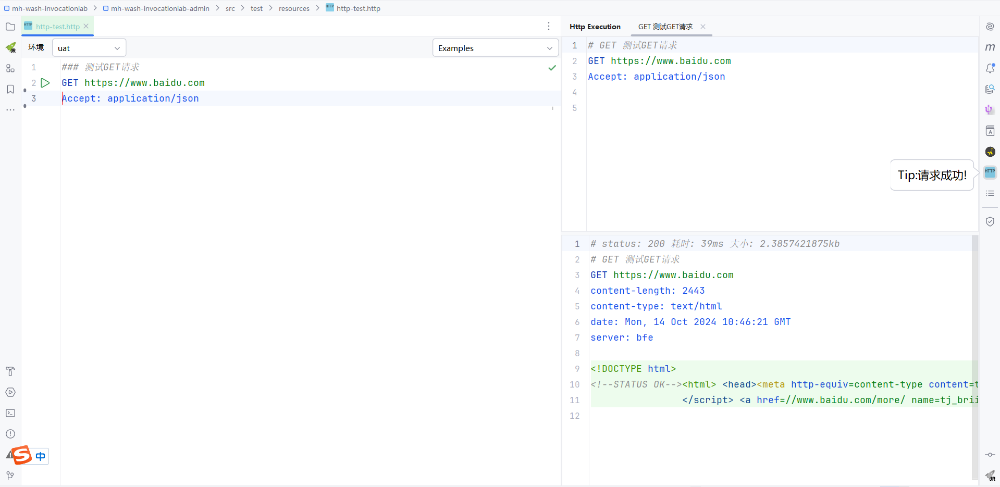

#### POST 请求

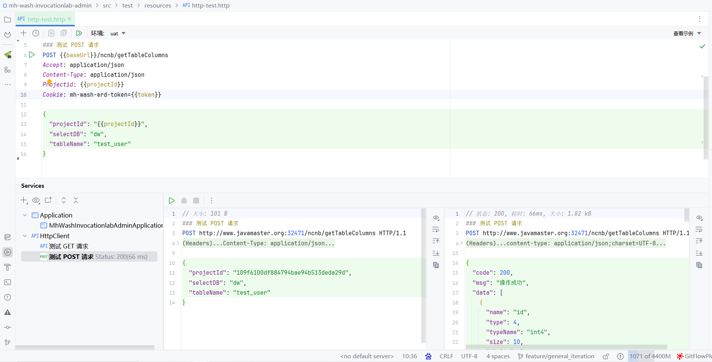

#### DUBBO 请求(针对项目中存在 Dubbo 接口类情况)

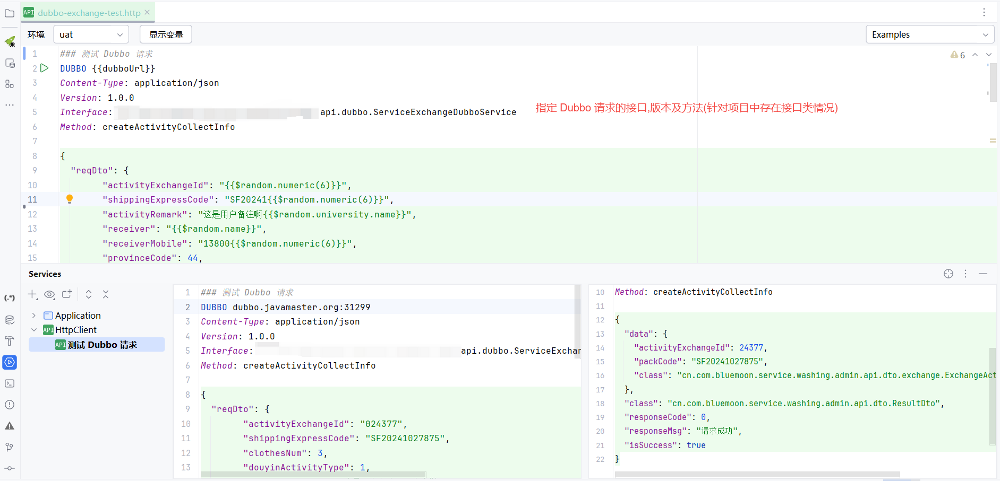

#### DUBBO 请求(针对项目中不存在 Dubbo 接口类情况)

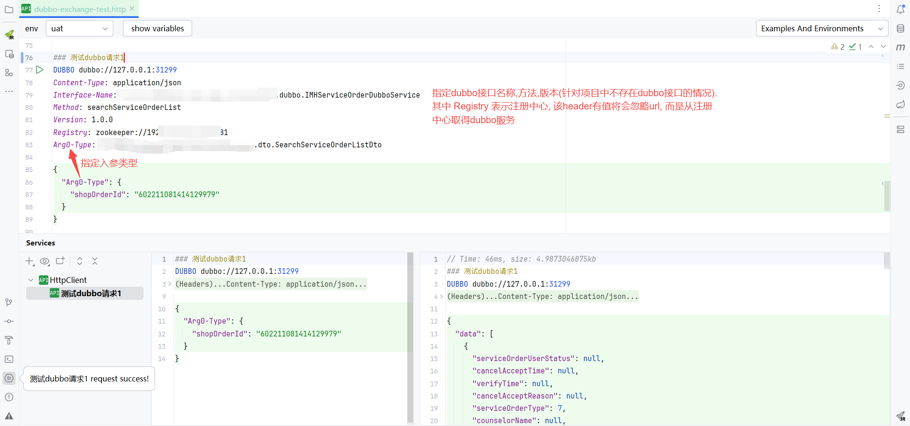

#### WebSocket 请求

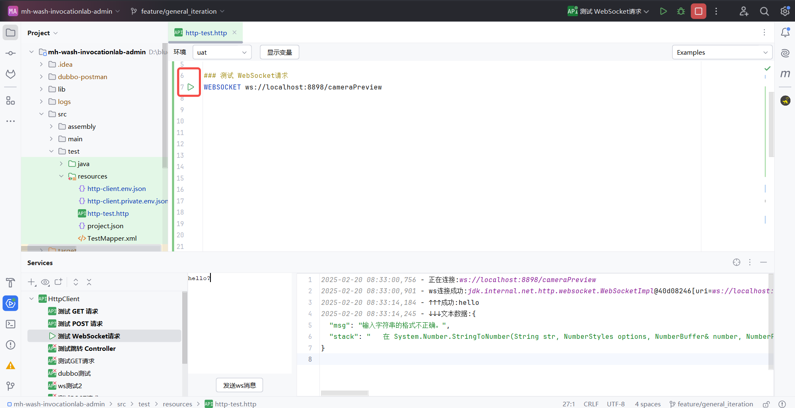

#### 环境变量跳转

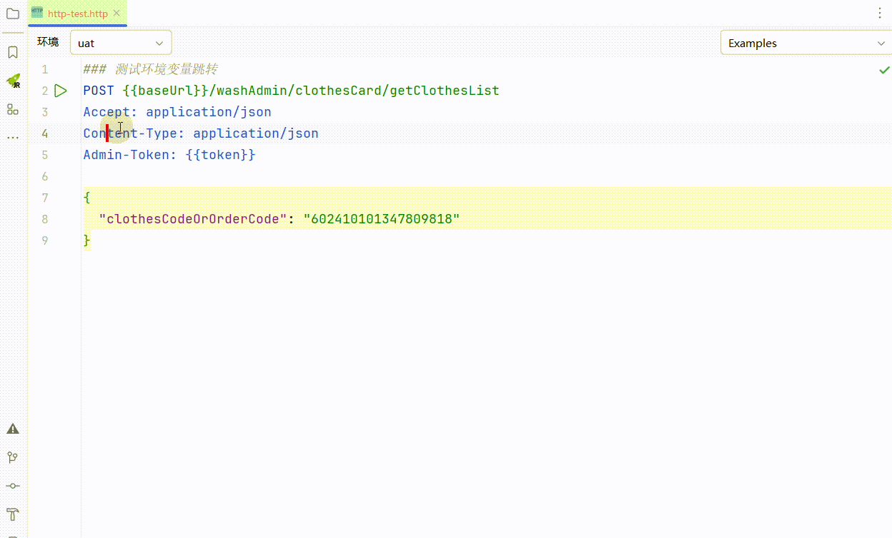

#### url 跳转 SpringMVC Controller 方法

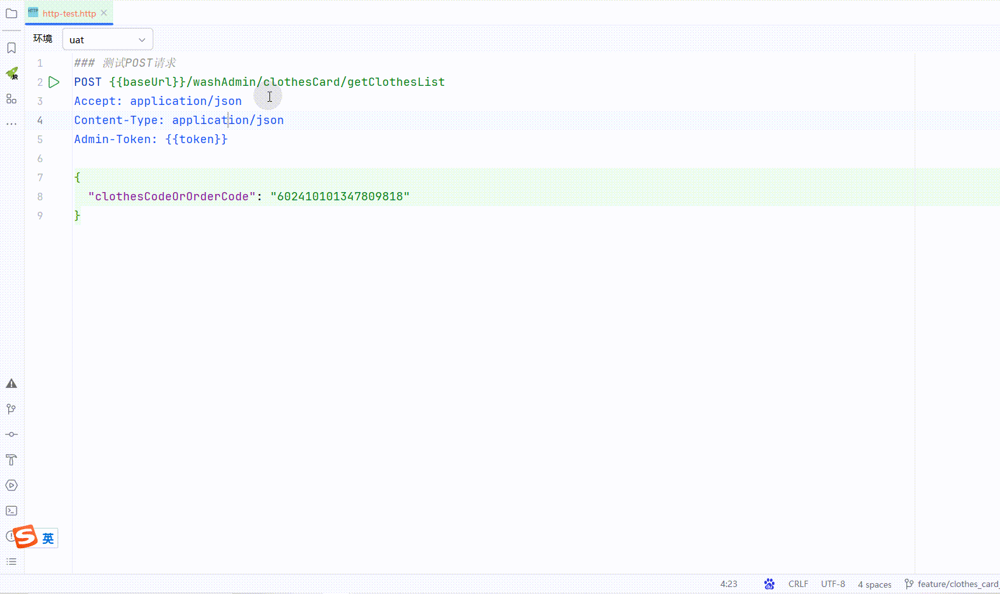

#### url 悬浮提示 SpringMVC Controller 方法

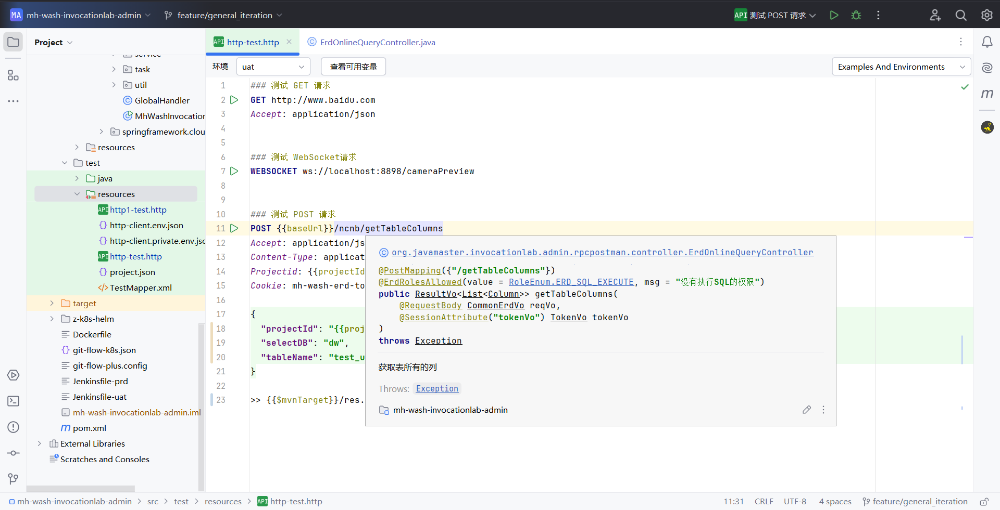

#### json 属性跳转 SpringMVC Controller 方法出入参 Bean 字段

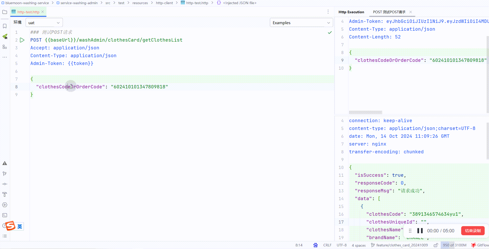

#### json 属性悬浮提示 SpringMVC Controller 方法出入参 Bean 字段

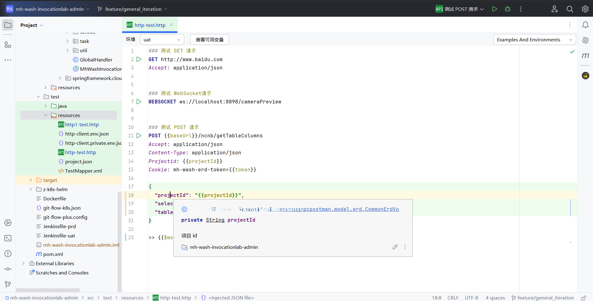
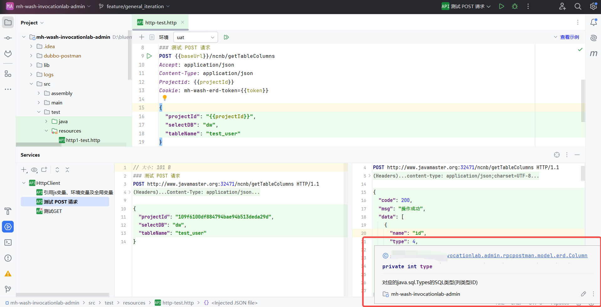

#### 在 SearchEverywhere 窗口搜索 SpringMVC Api

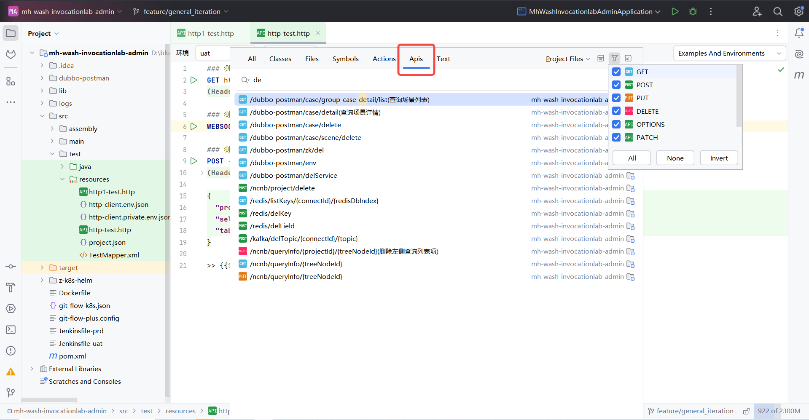

#### js处理器和全局变量

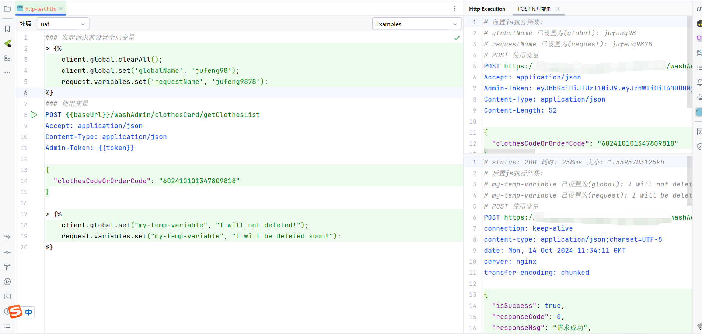

#### 保存响应到文件

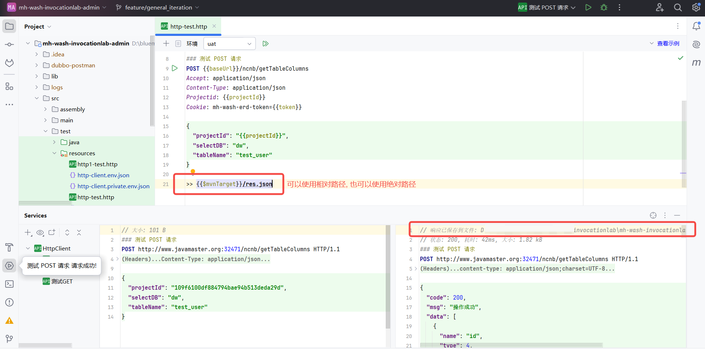

#### 预览图片


#### multipart请求

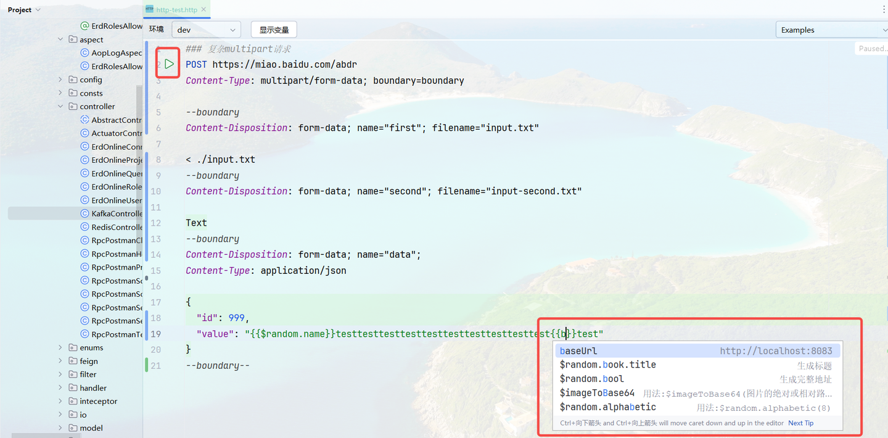

## 作者信息

- 作者博客：[知乎](https://www.zhihu.com/people/liang-yu-dong-44)
- 作者邮箱：375709770@qq.com
- github 地址：https://github.com/jufeng98

## 捐赠

如果项目帮到了您，请作者喝杯咖啡吧！


## 技术支持

微信记得备注 ```HttpRequest```，共同进步。

